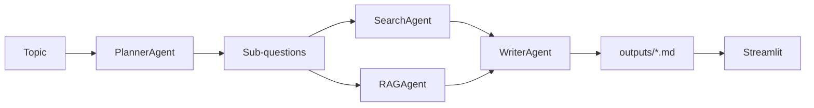

# Multi-Agent Research Pipeline

## Overview

This project is a multi-agent system that accepts a research topic, plans sub-questions, gathers evidence from web search and a local vector index, and produces a structured markdown report. It addresses the need for reproducible, tool-augmented research workflows where external retrieval and private documents are combined in one pipeline. The outcome is an auditable report file suitable for review or downstream use, exposed through a lightweight web UI.

## Key Features

- **Planner agent** decomposes a topic into a fixed set of sub-questions via structured JSON from the LLM, with a deterministic fallback if the model call fails.
- **Search agent** retrieves snippets per sub-question using the Serper API when `SERPER_API_KEY` is set; otherwise it falls back to keyword search over local reference documents.
- **RAG agent** queries ChromaDB for semantically similar chunks from ingested `.md` / `.txt` files, keyed by the same sub-questions as search.
- **Writer agent** synthesizes planner, search, and RAG context into markdown with enforced sections (title, executive summary, findings, recommendations, sources), with a non-LLM fallback report on failure.
- **Streamlit application** runs the full pipeline, previews sub-questions and the report, and offers a download of the generated file.
- **Static project site** in `web/` with `netlify.toml` for optional deployment of a portfolio landing page (separate from the Streamlit runtime).

## Tech Stack

| Area | Technologies |
|------|----------------|
| Language & runtime | Python 3.12 |
| Agents & orchestration | Modular agent classes (`agents/`), explicit handoff of `sub_questions` and per-question evidence dicts |
| LLM | OpenAI API or Azure OpenAI via `openai` SDK (`LLM_PROVIDER`, `LLM_MODEL`, Azure env vars in `.env.example`) |
| Retrieval & RAG | ChromaDB (persistent client), `DefaultEmbeddingFunction`, overlapping text chunks |
| Web search | Serper (`requests` to `google.serper.dev`) with local-document fallback |
| UI | Streamlit |
| Configuration | `python-dotenv` |
| Frontend hosting (optional) | Netlify (static `web/` publish) |

## Architecture / Approach

The pipeline is linear: **Planner → Search + RAG (parallel inputs to Writer) → Writer**. Sub-questions are the shared contract: each agent maps a sub-question string to a list of normalized evidence records (web or local for search; chunk metadata and scores for RAG). The writer builds a single prompt bundle from those structures and calls the LLM once for the final document, which keeps synthesis centralized and traceable.

Design choices include: JSON-shaped planner output for reliable parsing; tool-layer isolation in `tools/` (`SearchTool`, `VectorStore`); a thin `LLMClient` to switch OpenAI vs Azure without changing agent code; structured logging and try/except paths with fallbacks on planner, search, and writer failures.



## Installation & Setup

1. **Clone the repository** and create a Python 3.12 virtual environment.

2. **Install dependencies**

   ```bash
   pip install -r requirements.txt
   ```

   For development tests (e.g. benchmarks under `benchmarks/`), install dev requirements if needed:

   ```bash
   pip install -r requirements-dev.txt
   ```

3. **Configure environment**

   ```bash
   cp .env.example .env
   ```

   Set at minimum:

   - `OPENAI_API_KEY` (or Azure variables if `LLM_PROVIDER=azure`)
   - Optionally `SERPER_API_KEY` for web search

4. **Prepare the local corpus**  
   Add `.md` or `.txt` files under `reference_docs/`.

5. **Ingest into ChromaDB**

   ```bash
   python ingest.py --reference-dir reference_docs --persist-dir .chroma --collection-name research_docs
   ```

   Defaults match the above if flags are omitted.

## Usage

**Run the Streamlit app**

```bash
streamlit run app.py
```

In the UI, enter a research topic (for example: `retrieval-augmented generation for enterprise search`) and choose **Generate Report**. The app runs the full agent chain and shows planned sub-questions, a markdown preview, and a download button for the saved file.

**Ingest only** (no UI)

```bash
python ingest.py --reference-dir reference_docs --chunk-size 1000 --overlap 150
```

**Optional: deploy static landing page to Netlify**

```bash
npm install -g netlify-cli
netlify login
netlify init
netlify deploy --prod
```

Update the Streamlit link in `web/index.html` after you host the app elsewhere; Netlify serves static assets only.

## Results / Output

- **Artifacts**: One markdown file per run under `outputs/`, named with a sanitized topic prefix and UTC timestamp (e.g. `report-<topic>-<timestamp>.md`).
- **Report shape**: Markdown with `# Title`, `## Executive Summary`, `## Findings` (organized by sub-question with evidence references), `## Recommendations`, and `## Sources` when the LLM path succeeds; a simpler stitched fallback if the writer LLM call fails.
- **Observability**: INFO-level logs include pipeline steps and failures; the UI surfaces fatal errors without dumping stack traces to the end user.

Quantitative benchmarks are not claimed as product metrics; optional performance tests live under `benchmarks/` for local experimentation.

## Key Learnings

- **Explicit context contracts** (sub-question strings as dict keys) simplify multi-agent integration and debugging compared to opaque shared state.
- **Separating tools from agents** makes it straightforward to swap Serper vs local search or change chunking without touching orchestration logic.
- **Structured planner output** (JSON) reduces parsing fragility versus free-form bullet lists.
- **Provider abstraction at the LLM layer** keeps Azure and OpenAI deployments aligned with a single agent codebase.
- **Graceful degradation** (local search without API keys, fallback reports) keeps the demo runnable in constrained environments.

## Future Improvements

- Add an optional **critic or revision loop** that scores draft reports and triggers a second writer pass.
- **Stream writer output** in the Streamlit UI for lower perceived latency.
- **Evaluation script** (e.g. LLM-as-judge or checklist) on saved reports for regression testing.
- **CI workflow** for linting, tests, and optional ingest smoke tests against a fixture corpus.
- **First-class Azure AI Foundry** documentation and deployment notes aligned with production naming and endpoints.

---

*Conceptually aligned with topics from Microsoft’s [AI Agents for Beginners](https://github.com/microsoft/ai-agents-for-beginners) material (agent roles, planning, tool use, and agentic RAG).*
