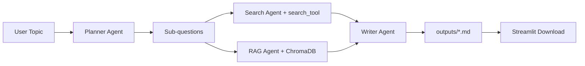

# Multi-Agent Research Pipeline

A portfolio-grade, production-style multi-agent research system inspired by patterns in Microsoft's **AI Agents for Beginners** lessons:

- `01-intro-to-ai-agents`
- `05-agentic-rag`
- `06-building-trustworthy-agents`
- `07-planning-design`

The app takes a research topic, decomposes it into sub-questions, retrieves evidence from search + local RAG, then writes a structured markdown report and saves it in `outputs/`.

## What It Does

- **Planner Agent** breaks a topic into focused sub-questions.
- **Search Agent** gathers evidence from web search (Serper) or local document fallback.
- **RAG Agent** retrieves local context from ChromaDB.
- **Writer Agent** synthesizes findings into a markdown report.
- **Streamlit UI** runs the full pipeline and allows markdown download.

## Architecture Overview



## Project Structure

```text
research-pipeline/
├── agents/
│   ├── planner.py
│   ├── searcher.py
│   ├── rag_agent.py
│   ├── writer.py
│   └── llm_client.py
├── tools/
│   ├── search_tool.py
│   └── vector_store.py
├── app.py
├── ingest.py
├── requirements.txt
├── .env.example
└── README.md
```

## Setup

1. Create and activate Python 3.12 virtual env.
2. Install deps:

   ```bash
   pip install -r requirements.txt
   ```

3. Configure environment:

   ```bash
   cp .env.example .env
   ```

4. Add reference docs (`.md` or `.txt`) to `reference_docs/`.
5. Ingest docs into Chroma:

   ```bash
   python ingest.py
   ```

6. Run Streamlit app:

   ```bash
   streamlit run app.py
   ```

## Report Output

- Reports are written to `outputs/` as timestamped markdown files.
- The Writer Agent enforces a structured format with summary, findings, takeaways, and sources.

## Demo / Screenshot

Add your UI screenshot or demo gif here:


> If `docs/demo.gif` does not exist yet, capture one with your local run and place it there.

## Notes on Tooling and Reliability

- Uses Python `logging` throughout for traceability.
- Each agent has isolated responsibilities and explicit context passing.
- Includes fallback behavior for planner output and search provider failures.
# Multi-Agent Research Pipeline

Portfolio-quality multi-agent system that orchestrates planning, tool-augmented search, local RAG retrieval, and report synthesis into a downloadable markdown output.

## What this project does

Given a user topic, the system runs a chain of specialized agents:

1. **Planner Agent** decomposes the topic into sub-questions.
2. **Search Agent** retrieves evidence from web search (or local mock corpus fallback).
3. **RAG Agent** queries local ChromaDB vectors from ingested reference docs.
4. **Writer Agent** synthesizes findings into a structured markdown report saved to `outputs/`.

A Streamlit UI provides a simple interface to generate and download reports.

## Architecture Overview

```text
User Topic (Streamlit)
      |
      v
PlannerAgent
  -> sub_questions
      |
      v
SearchAgent ---------> tool: SearchTool (web/local docs)
      |
      +-------> RAGAgent -----> tool: VectorStore (ChromaDB)
      |
      v
WriterAgent
  -> outputs/report-<topic>-<timestamp>.md
```

This follows core patterns from the Microsoft `ai-agents-for-beginners` lessons:
- intro to agents and role specialization
- agentic RAG orchestration
- trustworthy tool use and error handling
- planner-first agent design

## Project Structure

```text
research-pipeline/
├── agents/
│   ├── planner.py
│   ├── searcher.py
│   ├── rag_agent.py
│   ├── writer.py
│   └── llm_client.py
├── tools/
│   ├── search_tool.py
│   └── vector_store.py
├── app.py
├── ingest.py
├── requirements.txt
├── .env.example
└── README.md
```

## Setup

1. Create and activate a Python 3.12 virtual environment.
2. Install dependencies:

```bash
pip install -r requirements.txt
```

3. Create `.env` from sample and fill in keys:

```bash
cp .env.example .env
```

4. Add reference docs (`.md`/`.txt`) to `reference_docs/`.

## Ingest local docs into ChromaDB

```bash
python ingest.py --reference-dir reference_docs --persist-dir .chroma --collection-name research_docs
```

## Run the Streamlit app

```bash
streamlit run app.py
```

## Output

- Generated reports are written to `outputs/` as markdown files.
- The UI also shows a preview and provides a download button.

## Demo / Screenshot

Add a screenshot or short GIF after first run:

- Suggested path: `docs/demo.png` or `docs/demo.gif`
- Embed with:

```markdown

```
