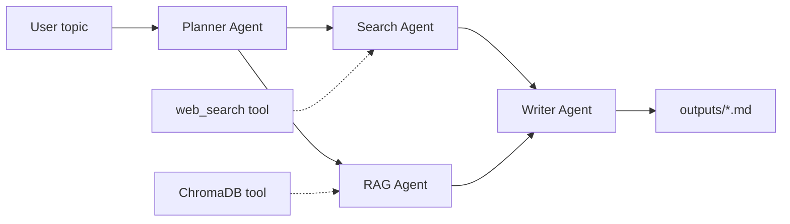

# Multi-Agent Research Pipeline

Portfolio-oriented demo of **agentic orchestration**, **tool use**, and **RAG** using the [Microsoft Agent Framework](https://github.com/microsoft/agent-framework) (MAF), inspired by lessons in [microsoft/ai-agents-for-beginners](https://github.com/microsoft/ai-agents-for-beginners) (intro, agentic RAG, trustworthy agents, planning).

## What it does

1. **Planner Agent** — splits your topic into sub-questions (structured JSON via MAF).
2. **Search Agent** — calls a **web search** tool (`duckduckgo-search`, or mock mode) per sub-question.
3. **RAG Agent** — calls a **ChromaDB** retrieval tool over ingested reference documents.
4. **Writer Agent** — merges all evidence into a **markdown report** under `outputs/`.

A small **Streamlit** UI runs the chain and lets you download the report.

## Architecture



Context is passed explicitly in code: the planner’s `sub_questions` drive parallel search + RAG branches, and both are serialized into the writer’s prompt (see `pipeline.py`).

## Setup

- **Python**: 3.11+ recommended (3.12 works; MAF supports current Python releases).
- Clone or copy this repo, then:

```bash
cd research-pipeline
python3 -m venv .venv
source .venv/bin/activate   # Windows: .venv\Scripts\activate
pip install -r requirements.txt
cp .env.example .env
# Edit .env: set OPENAI_API_KEY (or Azure OpenAI variables)
```

### Index reference documents (RAG)

```bash
python ingest.py --path ./reference_docs
```

### Run the UI

```bash
streamlit run app.py
```

Optional: `USE_MOCK_SEARCH=1` in `.env` disables live web search (offline / CI friendly).

## Configuration

| Variable | Purpose |
|----------|---------|
| `OPENAI_API_KEY` | OpenAI or compatible API key |
| `OPENAI_MODEL` | Model id (default `gpt-4o-mini`) |
| `OPENAI_BASE_URL` | Optional OpenAI-compatible base URL |
| `AZURE_OPENAI_*` | Alternative to direct OpenAI (see `.env.example`) |
| `CHROMA_PERSIST_DIR` | Chroma persistence path (default `.chroma`) |
| `USE_MOCK_SEARCH` | `1` for mock web results |

## Demo / screenshot

After `streamlit run app.py`, enter a topic and run the pipeline. For your portfolio README, add a screenshot (for example save it as `docs/ui-screenshot.png` and reference it here). The Mermaid diagram above serves as the architecture figure for version control without binary assets.

## Project layout

```
research-pipeline/
├── agents/           # planner, searcher, rag_agent, writer
├── benchmarks/       # pytest-benchmark micro-benchmarks
├── scripts/          # profiling helpers
├── tools/            # search_tool, vector_store
├── app.py            # Streamlit entrypoint
├── pipeline.py       # orchestration + context passing
├── ingest.py         # Chroma ingest CLI
├── llm_client.py     # OpenAI / Azure OpenAI client factory
├── reference_docs/   # sample markdown for ingest
└── outputs/          # generated reports (.md)
```

## Benchmarks and performance

Micro-benchmarks (vector chunking, Chroma queries, repeated `count()`):

```bash
pip install -r requirements-dev.txt
pytest benchmarks/ --benchmark-only -v
```

Profile Chroma query + count hot paths:

```bash
python scripts/profile_vector_store.py
```

**Findings (local runs):** the slowest micro-benchmark was repeated `format_query_results` on a warm store. Profiling showed Chroma’s `DefaultEmbeddingFunction` builds a **new** `ONNXMiniLM_L6_V2` (and ONNX InferenceSession) on **every** embed call (`chromadb.api.types.DefaultEmbeddingFunction.__call__`). The app now reuses a single `ONNXMiniLM_L6_V2` via `tools/vector_store.py`. `VectorStore.count()` is also cached (invalidated on upsert) so planner/RAG empty checks do not hammer SQLite. The pipeline overlaps **web search** and **RAG** LLM work per sub-question with `asyncio.gather` to save roughly one LLM round-trip per sub-question versus strict sequential awaits.

## References

- [Microsoft Agent Framework](https://github.com/microsoft/agent-framework)
- [AI Agents for Beginners](https://github.com/microsoft/ai-agents-for-beginners) — lessons `01-intro-to-ai-agents`, `05-agentic-rag`, `06-building-trustworthy-agents`, `07-planning-design`, `14-microsoft-agent-framework`

## Stretch goals (not implemented here)

- Critic agent for revision loops  
- Token streaming from the writer in Streamlit  
- LLM-as-judge eval script for report quality  
