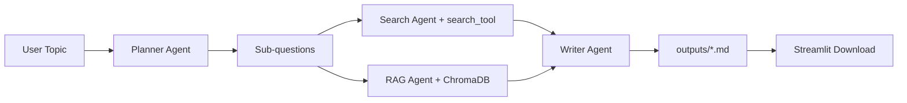

# Multi-Agent Research Pipeline

A portfolio-grade, production-style multi-agent research system inspired by patterns in Microsoft's **AI Agents for Beginners** lessons:

- `01-intro-to-ai-agents`
- `05-agentic-rag`
- `06-building-trustworthy-agents`
- `07-planning-design`

The app takes a research topic, decomposes it into sub-questions, retrieves evidence from search + local RAG, then writes a structured markdown report and saves it in `outputs/`.

## What It Does

- **Planner Agent** breaks a topic into focused sub-questions.
- **Search Agent** gathers evidence from web search (Serper) or local document fallback.
- **RAG Agent** retrieves local context from ChromaDB.
- **Writer Agent** synthesizes findings into a markdown report.
- **Streamlit UI** runs the full pipeline and allows markdown download.

## Architecture Overview



## Project Structure

```text
research-pipeline/
├── agents/
│   ├── planner.py
│   ├── searcher.py
│   ├── rag_agent.py
│   ├── writer.py
│   └── llm_client.py
├── tools/
│   ├── search_tool.py
│   └── vector_store.py
├── web/ # static portfolio site (Netlify)
├── netlify.toml         # Netlify build/publish config
├── app.py
├── ingest.py
├── requirements.txt
├── .env.example
└── README.md
```

## Setup

1. Create and activate Python 3.12 virtual env.
2. Install deps:

   ```bash
   pip install -r requirements.txt
   ```

3. Configure environment:

   ```bash
   cp .env.example .env
   ```

4. Add reference docs (`.md` or `.txt`) to `reference_docs/`.
5. Ingest docs into Chroma:

   ```bash
   python ingest.py
   ```

6. Run Streamlit app:

   ```bash
   streamlit run app.py
   ```

## Report Output

- Reports are written to `outputs/` as timestamped markdown files.
- The Writer Agent enforces a structured format with summary, findings, takeaways, and sources.

## Demo / Screenshot

Add your UI screenshot or demo gif here:


> If `docs/demo.gif` does not exist yet, capture one with your local run and place it there.

## Netlify Website Setup

This repository includes a static portfolio site in `web/` with Netlify config in `netlify.toml`.

### Deploy with Netlify CLI

1. Install CLI:

   ```bash
   npm install -g netlify-cli
   ```

2. Login:

   ```bash
   netlify login
   ```

3. Initialize this folder as a Netlify site:

   ```bash
   netlify init
   ```

4. Deploy preview:

   ```bash
   netlify deploy
   ```

5. Deploy production:

   ```bash
   netlify deploy --prod
   ```

After deploy, update the "Live App" button in `web/index.html` with your hosted Streamlit URL.

## Notes on Tooling and Reliability

- Uses Python `logging` throughout for traceability.
- Each agent has isolated responsibilities and explicit context passing.
- Includes fallback behavior for planner output and search provider failures.
